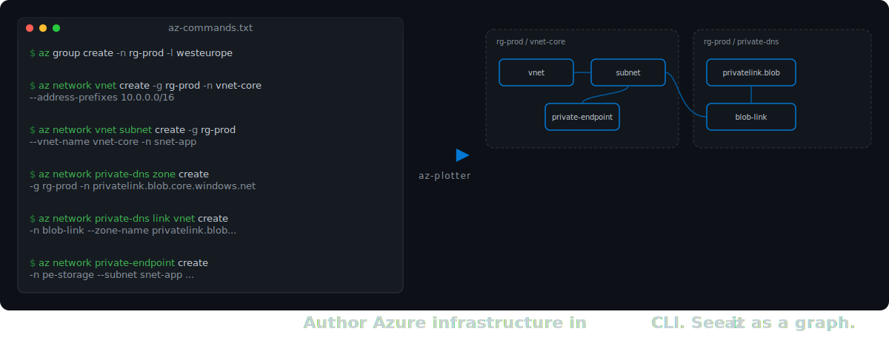
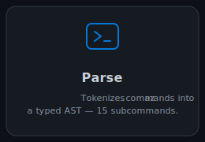
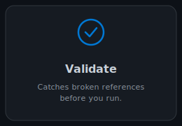
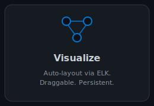
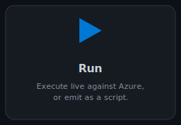
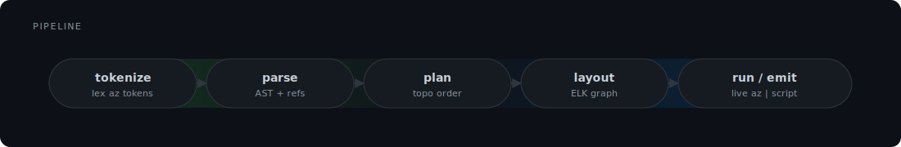
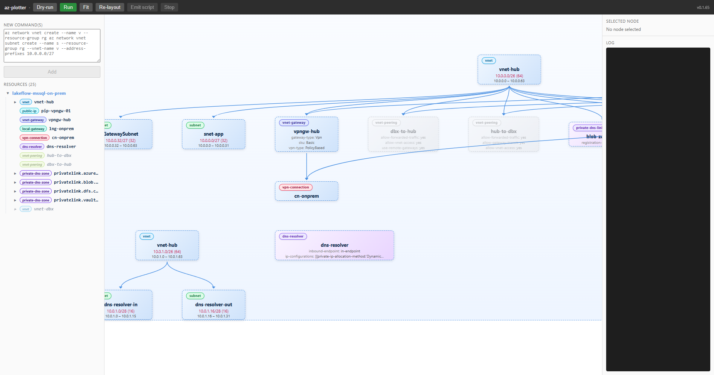

# az-plotter

<p align="center">
  
</p>

<p align="center">
  
  
  
  
</p>

A Windows desktop app that parses `az` CLI commands into a typed model of your Azure infrastructure, lays it out as an interactive graph, and either runs it live against Azure or emits an idempotent script. Built with Tauri, Svelte, and Rust.

## What it does

<table>
  <tr>
    <td align="center"></td>
    <td align="center"></td>
    <td align="center"></td>
    <td align="center"></td>
  </tr>
</table>

## How it works

<p align="center">
  
</p>

The static pipeline runs left-to-right. The **tokenizer** splits raw `az` invocations into structured tokens. The **parser** builds a typed AST and resolves cross-command references (e.g. a private-endpoint pointing to a subnet declared four lines earlier). The **planner** orders commands topologically so dependencies always come before dependents. The **layout** stage hands that graph to ELK, which produces coordinates for the Svelte Flow renderer. By the time it hits the screen, every edge represents a real Azure dependency.

At runtime, az-plotter can either execute the plan live — dispatching each command through the local `az` CLI and streaming stdout/stderr into the UI — or emit a plain shell script for use elsewhere. A verification subsystem (`src-tauri/src/verify/`) that will cross-check the graph against real Azure state is scaffolded but not yet wired up.

## See it running

<p align="center">
  
</p>

## Install

1. Grab the latest `.msi` (WiX) or `.exe` (NSIS) installer from [Releases](../../releases).
2. Run it. The NSIS installer is per-user and requires no admin rights.
3. Launch **az-plotter** from the Start menu.

## Build from source

Prerequisites: Rust toolchain, Node.js 18+, and the [Tauri v1 prereqs](https://tauri.app/v1/guides/getting-started/prerequisites) (MSVC build tools + WebView2 on Windows).

```bash
git clone https://github.com/<owner>/az-viz-web.git
cd az-viz-web
npm --prefix ui install
cargo tauri dev          # run in development
cargo tauri build        # produce MSI and NSIS installers
```

Release artifacts land in `target/release/bundle/{msi,nsis}/`.

## License

MIT.
